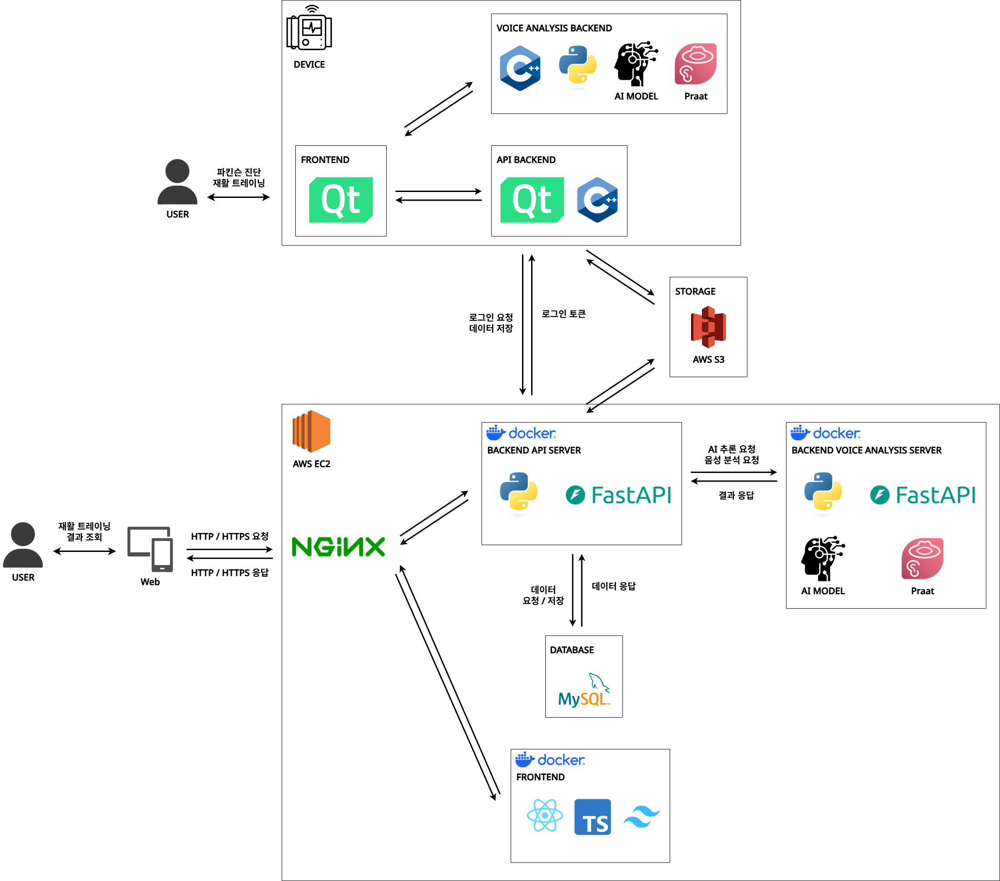

# 프로젝트에서 사용하는 외부 서비스 정보를 정리한 문서
## Amazon S3
- 사용자 음성 녹음 파일을 저장하고 서빙하기 위한 클라우드 스토리지로 사용합니다.

## Amazon EC2 (Elastic Compute Cloud)
- 클라우드 기반의 가상 서버 환경을 제공하여, 물리 서버 없이도 애플리케이션을 배포하고 인터넷을 통해 24시간 안정적으로 서비스를 운영할 수 있게 합니다.

## 시스템 아키텍쳐
